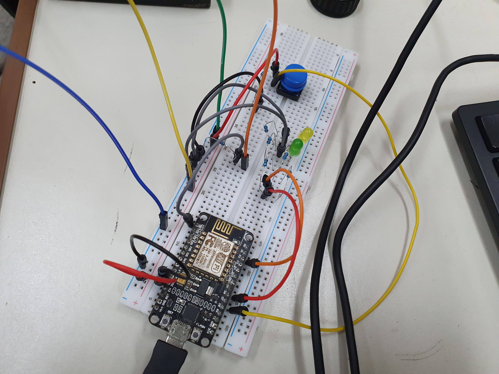
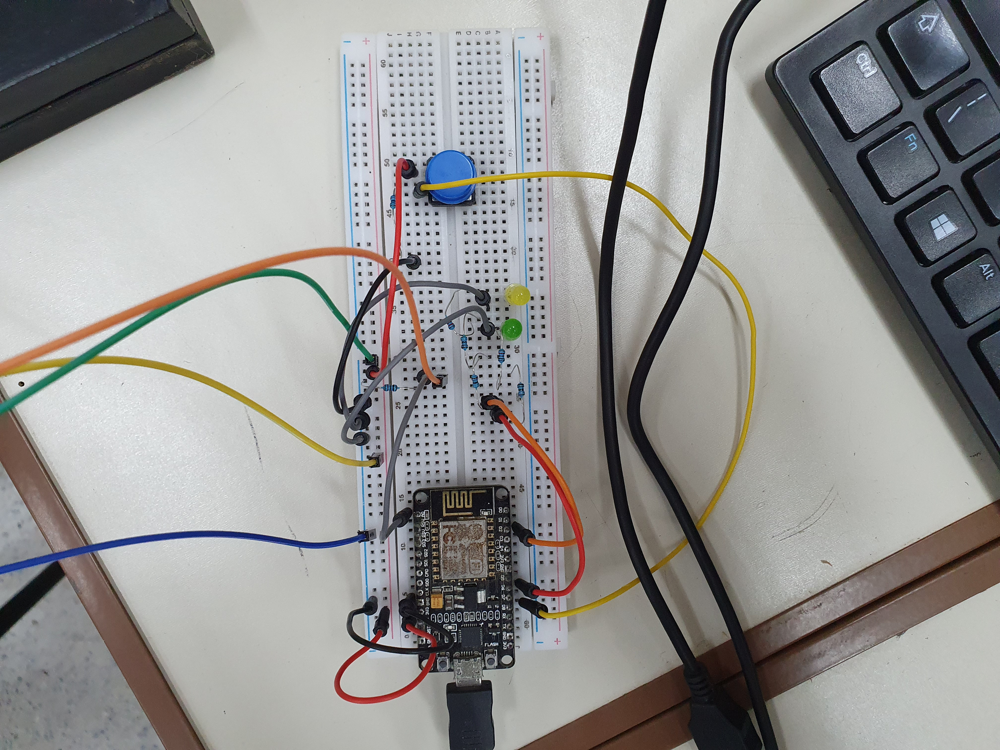
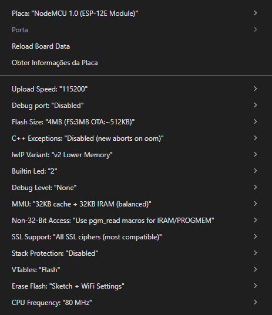

# Contador de soro com Arduino

## Lista de materiais mínimos

- 1 x Push button
- 2 x LEDs (preferencialmente, 1 amarelo e 1 verde)
- 1 x Laser de 650nm (ou qualquer comprimento de onda dentro do espectro de luz visível)
- 1 x fotoresistor (LDR)

### Resistores

Como utilizamos um NodeMCU ESP8266 no lugar de uma placa arduino, a saída do VCC é de 3.3v, invés de 5v.

Em 3.3v, o LED amarelo precisou de 140Ω (120Ω + 10Ω) e o verde de 130Ω (120Ω + 10Ω). Esses valores não precisam ser exatos, mas caso esse seja o caso, o LED ficará mais fraco. 220Ω para os 2 LEDs funcionam bem em 5v.

O laser utilizado no projeto (KY-008) já possui um resistor acoplado no IC. Não é necessário adicionar mais resistência para ligar no 5v.

Para o fotoresistor é ideal utilizar um resistor entre 10kΩ e 100kΩ, utilizamos 10kΩ no projeto e não testamos nenhuma outra configuração.

Além disso, também é necessário 1 resistor de 10kΩ para o pull down do botão.

Mantendo essas especificações, a lista de resistores é:

- 2 x 10kΩ
- 2 x 120Ω
- 3 x 10Ω

### Placa

O código é compatível com Arduino, além do ESP utilizado no projeto. Em teoria é compatível com qualquer placa que utiliza drivers CH340 ou CP210x, embora apenas testamos o código com Arduino Uno e ESP8266 NodeMCU.

O ESP possui somente 1 entrada analógica (A0), que é suficiente para o projeto atual, mas deve ser levado em consideração para modificações futuras.

## Imagens para remontagem do projeto





### [Vídeos do projeto em funcionamento](videos/)

## Documentação do projeto

### Dependências

#### Pacote de placas

Para programar um ESP na IDE do Arduino é necessário incluir o pacote:

`https://arduino.esp8266.com/stable/package_esp8266com_index.json`

em:

`Arquivos > Preferências > URLs do Gerenciador de Placas Adicionais`

(apenas copie o link e inclua na text-box, não é necessário abrir o link ou baixar qualquer arquivo)

#### Drivers de comunicação serial

Talvez* seja necessário baixar o driver CP2102 (CP210x), que pode ser encontrado [neste link](https://www.silabs.com/software-and-tools/usb-to-uart-bridge-vcp-drivers?tab=downloads)

\*Pode ser possível dar flash para o ESP sem o driver (foi o caso no meu computador pessoal), mas a serial pode não funcionar corretamente. Se possível, é recomendado utilizar este driver.

#### Configurações para o Flash



Esta placa pode ser encontrada em `esp8266` no gerenciador de placas. Caso não apareça, certifique-se de ter baixado corretamente o pacote e reinicie a IDE.

#### Bibliotecas

Todas as bibliotecas incluídas (`ESP8266WiFi.h`, `ESP8266HTTPClient.h` e `WiFiClient.h`) são built-in do pacote. Além disso, são apenas necessárias para a comunicação via WiFi (que não obtivemos sucesso no trabalho).

Por isso, é possível reconstruir o projeto em uma placa Arduino, sem utilizar essas bibliotecas e seus métodos, com as devidas alterações no código.

### Servidor em python

Embora a comunicação via internet não tenha funcionado, fizemos um [código para o servidor](projeto/pythonServer). Faltando apenas a parte de front-end.

Para executar o código:

```bash
cd projeto/pythonServer
python3 -m venv .venv
source .venv/bin/activate
pip install -r requirements.txt
python3 app.py
```

### Documentação do código de arduino

#### Replicação visual do experimento

No código existe uma função responsável pela calibragem da luz quando o botão é pressionado (ou nos 3 primeiros do boot). É importante que o soro **NÃO** esteja gotejando enquanto a calibração está sendo executada (explicarei o porquê mais a frente).

Embora exista essa função. A parte mais significativa da calibragem deve ser feita no próprio código (não consegui pensar em alguma forma de fazer automaticamente, pois são muitas variáveis de ambiente).

Todas essas variáveis serão explicadas mais adiante, mas tenha em mente que o valor ideal para elas depende do ambiente em que o teste está sendo feito.

Algumas constantes que devem ser mexidas são:

- `ALPHA` (linha 20)
- `threshold_multiplier` (linha 22)
- O número mágico `1.5` (linha 167) (perdão por não usar uma constante)

Além disso, todas as variáveis de tempo (`DEBOUNCE_INTERVAL_MS`, `SEND_INTERVAL_MS` e `GREEN_LED_BLINK_TIME_MS`). O `OVERSAMPLE_SIZE` pode ser mexido, mas devem ser feitas algumas alterações no código para isso.

Dentro o `setup()`, o número mágico `3000` (perdão, novamente), é o tempo em milissegundos que a calibragem roda no setup. Se o projeto não estiver funcionando de modo algum, tente mudar para `0`.

#### Constantes e variáveis:

##### WiFi
```c
constexpr const char* WIFI_SSID = "arduino";
constexpr const char* WIFI_PASSWD = "arduino123";
constexpr const char* SERVER_URL = "http://192.168.3.126:5000/send";
```
Na prática, não servem para nada já que o wifi não funciona.
Para descobrir o IP no Linux, basta digitar `ip a` ou `ifconfig` no terminal e colar o número depois do inet. No Windows, deve aparecer em algum lugar com `ipconfig`.

É importante que o computador rodando o servidor esteja na mesma rede que o ESP. Resalto isso, pois os computadores do laboratório não tem placa WiFi.

##### Pinout
```c
#define LDR_PIN A0
#define BUTTON_PIN D8
#define GREEN_LED_PIN D6
#define YELLOW_LED_PIN D2
```

##### Constantes
```c
// Tempo de debounce do botão.
constexpr unsigned int DEBOUNCE_INTERVAL_MS = 2000;
// Tempo de envio de pacotes (não usado).
constexpr unsigned int SEND_INTERVAL_MS = 2000;
// Tempo máximo que o LED verde fica aceso quando cai uma gota.
constexpr unsigned int GREEN_LED_BLINK_TIME_MS = 100;
// Usado na função updateBaseline para calcular a média móvel exponencial (ignore o comentário que eu botei no código, provavelmente vai precisar mudar).
constexpr float ALPHA = 0.2;
// Usado na função readSensorAmplified para calcular o oversample.
constexpr unsigned int OVERSAMPLE_SIZE = 64;
// Limiar de variação para detectar quando saiu da gota atual, usado na função detectDrop().
constexpr float threshold_multiplier = 0.3;
```

As demais variáveis serão explicadas em suas funções.

#### Funções

```c
void blinkGreenLEDat(bool should_blink)
```
Pisca o LED verde, com um debounce e temporizador (`unsigned long int green_led_timer`).

```c
long readSensorAmplified(void)
```
Os comentários no código já explicam bem como esta função funciona. Ela basicamente "amplifica" o sinal analógico, lendo `OVERSAMPLE_SIZE` valores do LDR, invés de somente 1.

```c
bool detectDrop(void)
```
A função começa lendo o `raw_value`, que é o valor retornado de `readSensorAmplified()`. Por algum motivo, além de apenas detectar quando a gota cai, ela imprime no Serial e calibra o detector. (Não sei porque eu fiz isso)

O código tem uma variável que é *invertida* quando está em modo calibração, chamada `is_calibrating`.

O trecho de código:

```c
if(is_calibrating){
    long noise = abs(raw_value - light_baseline);
    if(noise > calibration_max_noise){
        calibration_max_noise = noise;
    }
    updateBaseline(raw_value);
    return false;
}
```
acumula o ruído na variável `noise` e busca o maior ruído encontrado, que será usado para recalcular a média móvel exponencial (MME) em `updateBaseline()`. Essa parte sempre retorna `false`, por isso a calibração não deve ser feita enquanto uma gota estiver caindo. Além de não contar essa gota, ela irá ser interpretada como ruído, o que contamina o gráfico da *MME*

```c
long diff = (light_baseline - raw_value);

if(!is_inside_drop){
    if(diff > calibrated_threshold){
        is_inside_drop = true;
        return true;
    }
    else{
        updateBaseline(raw_value);
        return false;
    }
}
else{
    if(diff < (calibrated_threshold * threshold_multiplier)){
        is_inside_drop = false;
    }
    return false;
}
```
O trecho de código acima corresponde à contagem de gotas (se alguém for modificar este código, por favor mude essa função para fazer apenas isso).

A variável `is_inside_drop` serve para tentar mitigar falsos positivos, sem usar um temporizador. Para detectar quando saiu da gota e atualizar o valor da variável, a diferença entre o valor lido (*raw_value*) e o valor do *MME* deve ser menor que o *threshold* multiplicado por um número arbritário entre 0 e 1.
Por isso, mudar o `threshold_multiplier` pode ajudar, se ele for muito alto é mais propício a ocorrer falsos positivos, e se for muito baixo, pode ocorrer falsos negativos.

```c
void updateBaseline(long raw_value)
```
Função responsável por calcular a média móvel exponencial, recomendo ler a página da [Wikipedia](https://en.wikipedia.org/wiki/Exponential_smoothing).

Resumidamente, é uma função de normalização e suavização. Ela é usada no código como uma margem de tendência. "Se nenhuma gota estiver pingando, como é o gráfico das leituras do LDR?". É possível usar somente os valores direto do sensor (*raw_value*) e o *threshold*, mas existem muitas variações que podem ocorrer por movimento do sensor, ruído, e alterações na luz do ambiente.

A constante `ALPHA` é exatamente o α da função, que é o fator de suavização. Essa constante precisa estar entre [0, 1], mas não teria motivos para passar de 0.5. Valores mais altos de `ALPHA` serão menos suaves, enquanto valores mais baixos aumentam a suavidade. Para minimizar falsos positivos, é melhor diminuir o valor. Já em casos de falsos negativos, é melhor aumentar um pouco este valor.

```c
void handleCalibration(void)
```
Esta função é responsável por inicializar e finalizar a calibração (quem faz a calibração em si, é o `detectDrop()`).

Para inicializar, ela zera o valor da variável que armazena o ruído máximo `calibrated_max_noise`, e começa a contagem da `light_baseline`. É importante a `light_baseline` nunca ser zerada, senão o algoritmo de *MME* não irá funcionar.

Na finalização, o *threshold* (`calibrated_threshold`) recebe o valor do ruído máximo (multiplicado por um número arbitário, para adicionar uma margem de erro). Quanto maior for a margem de erro, menos falsos negativos, quanto menor, menos falsos positivos.

```c
void handleButtonPress(void)
```
Função simples de botão com debounce, que é usado para ativar e desativar a calibração. O debounce é temporizado, como explicado em comentário no código, o ideal é que a calibração dure alguns segundos.

```c
bool sendPayload(String payload)
bool sendDropTime(bool drop_detected)
```
Essas demais funções servem para comunicação com o wifi. Então, ou existe algum erro nelas, ou existe algum erro no código do servidor (ou talvez não tenha nenhum erro). Os prints no Serial dentro desta função foram feitos pelo ChatGPT enquanto eu tentava descobrir o erro. Não me lembro se esta função foi modificada por essa ferramenta, ou se ela sempre foi assim.